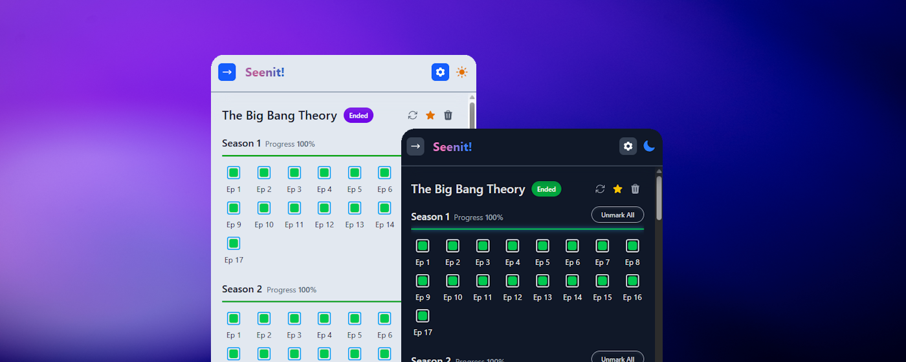

<div align="center">
  

# Seenit! - Episode Tracker

  <p align="center">
    <strong>Your personal series companion that lives in your browser</strong>
    <br />
    Keep track of your favorite TV shows with a beautiful, intuitive interface
  </p>

  <p align="center">
    
    
    
    
    
  </p>

  <p align="center">
    <a href="#-features">Features</a> •
    <a href="#-installation">Installation</a> •
    <a href="#-development">Development</a> •
    <a href="#-tech-stack">Tech Stack</a> •
    <a href="#-license">License</a>
  </p>
</div>

---

<div align="center">
  
</div>

## Features

### Core Functionality

- **Series Tracking** - Add and track multiple TV series with complete metadata
- **Progress Monitoring** - Visual progress bars for seasons and episodes
- **Episode Management** - Mark episodes as watched/unwatched with a single click
- **Favorites System** - Star your favorite series for quick access
- **Smart Search** - Search for new series to track
- **Filter & Sort** - Filter series by title or genre

### Data Management

- **100% Local Storage** - All data stored locally using Chrome Storage API
- **Export/Import** - Backup and restore your tracking data
- **Auto-Refresh** - Keep series metadata up to date

---

## Installation

### Install from Store

<p align="left">
  <a href="https://chromewebstore.google.com/detail/seenit-episode-tracker/amopmnmnaimidbcfnjbnlfagmlmdhlch" target="_blank">
    
  </a>
  <br />
  <br />
  <em>Firefox version coming soon</em>
</p>

### Install Manually

#### For Chrome

1. Download the latest release or build from source
2. Open Chrome and navigate to `chrome://extensions`
3. Enable "Developer mode" (toggle in top-right)
4. Click "Load unpacked"
5. Select the `dist_chrome` folder

#### For Firefox

1. Download the latest release or build from source
2. Open Firefox and navigate to `about:debugging#/runtime/this-firefox`
3. Click "Load Temporary Add-on"
4. Select any file in the `dist_firefox` folder (e.g., `manifest.json`)

---

## Development

### Prerequisites

- Node.js >= 24
- npm

### Setup

```bash
# Clone the repository
git clone https://github.com/farengeyt451/seenit-extension.git
cd seenit-extension

# Install dependencies
npm install
# or
yarn install
```

### Development Mode

```bash
# Start development for Chrome (with hot reload)
npm run dev:chrome

# Start development for Firefox (with hot reload)
npm run dev:firefox
```

### Build for Production

```bash
# Build for Chrome
npm run build:chrome

# Build for Firefox
npm run build:firefox
```

Output will be in `dist_chrome` or `dist_firefox` folders.

---

## Tech Stack

### Core Technologies

- **[React 19](https://react.dev/)**
- **[TypeScript 5.9](https://www.typescriptlang.org/)**
- **[Vite 7.3](https://vitejs.dev/)**
- **[Tailwind CSS 4.1](https://tailwindcss.com/)**

### State Management & Data

- **[Zustand 5.0](https://github.com/pmndrs/zustand)**
- **[Immer 11.1](https://immerjs.github.io/immer/)**
- **[Zod 4.2](https://zod.dev/)**
- **Chrome Storage API**

### UI Components

- **[Headless UI 2.2](https://headlessui.com/)**
- **[Heroicons 2.2](https://heroicons.com/)**
- **[React Rewards 2.1](https://github.com/thedevelobear/react-rewards)**

### Utilities

- **[Luxon 3.7](https://moment.github.io/luxon/)**
- **[Axios 1.13](https://axios-http.com/)**
- **[@uidotdev/usehooks](https://usehooks.com/)**
- **[clsx 2.1](https://github.com/lukeed/clsx)**

### Development Tools

- **[@crxjs/vite-plugin](https://crxjs.dev/vite-plugin/)**
- **[ESLint 9](https://eslint.org/)**
- **[Prettier 3.7](https://prettier.io/)**
- **[Nodemon 3.1](https://nodemon.io/)**

---

## Project Structure

```
seenit-extension/
├── public/               # Static assets (icons)
├── src/
│   ├── components/       # React components
│   │   ├── ui/           # Reusable UI components
│   │   ├── episodes-tracker/
│   │   ├── search/
│   │   └── ...
│   ├── store/            # Zustand stores
│   │   ├── useSeriesStore.ts
│   │   ├── useThemeStore.ts
│   │   └── ...
│   ├── hooks/            # Custom React hooks
│   ├── utils/            # Utility functions
│   ├── types/            # TypeScript types
│   ├── enums/            # Enums and constants
│   └── pages/
│       ├── popup/        # Main extension popup
│       └── background/   # Background script (optional)
├── manifest.json         # Extension manifest
├── vite.config.*.ts      # Vite configurations
└── package.json
```

---

## License

This project is **Source-Available** under a **Non-Commercial Proprietary License**.

**You are allowed to:**

- ✅ View the source code
- ✅ Modify it for personal, non-commercial use only

**You are NOT allowed to:**

- 🚫 Sell, license, redistribute, or publish this software or any modified versions
- 🚫 Use any part of this software for commercial purposes
- 🚫 Re-upload to any browser extension store without explicit written permission
- 🚫 Reverse engineer premium features or server components

All rights not explicitly granted are reserved by the author.

For commercial permissions or business inquiries, contact: **seenitapp@outlook.com**

For more details, see the [LICENSE](LICENSE) file.

---

## Acknowledgments

- Built with the [Vite Web Extension Boilerplate](https://github.com/JohnBra/vite-web-extension) by Jonathan Braat
- Series metadata powered by [THETVDB API](https://www.thetvdb.com/)
- Icons by [Heroicons](https://heroicons.com/)

---

<div align="center">
  <p>
    <a href="https://github.com/farengeyt451/seenit-extension/issues">Report Bug</a> •
    <a href="https://github.com/farengeyt451/seenit-extension/issues">Request Feature</a>
  </p>
</div>
